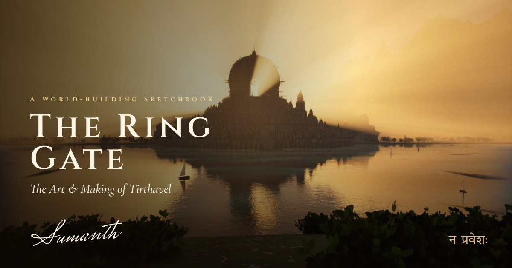

# Tirthavel · The Ring Gate — Art & Making

[](https://su3doesign.github.io/Tirthavel/)

**[Open the book →](https://su3doesign.github.io/Tirthavel/)**

A concept-art book as a website: the world-building sketchbook behind **Kaalavalaya**, a 156-metre stone ring with a door no one may enter, and **Tirthavel**, the drowned city that climbs toward it.

- A scroll-driven three.js story built on the real gate mesh: one day passes over the Ring, from dawn to the Hollow Sun.
- Chapters on origins and lore, why a ring, the Mahabharata echoes behind it, the gate, the citadel, materials, the sea, light and the making-of, with hand-drawn annotations throughout.
- A 3D turntable of the gate in clay, ink, stone and overgrown looks.

## Run it locally

The 3D parts load files, so the page needs a local server rather than a double-click:

```sh
python3 -m http.server 8000
# then open http://localhost:8000
```

## Publish with GitHub Pages

Go to **Settings → Pages** and set **Source** to **Deploy from a branch**, then pick **main** and **/ (root)**. The site appears at `https://su3doesign.github.io/Tirthavel/`.

Everything is vendored (three.js, rough.js, fonts), so the page makes no external requests.

## Add it to a portfolio

As a card that opens the book:

```html
<a href="https://su3doesign.github.io/Tirthavel/" target="_blank" rel="noopener">
  
</a>
```

Or embedded in a page. The story scrolls inside the frame, so give it most of the screen:

```html
<iframe src="https://su3doesign.github.io/Tirthavel/" title="The Ring Gate — Art & Making"
        style="width:100%; height:90vh; border:0" loading="lazy"></iframe>
```

Shared links show the same card, because the page sets `og:image` and `twitter:image` to `assets/ui/social.jpg`.

## Credits

Concept, world-building, renders, sketches and writing by Sumanth, 2026. All rights reserved.

The world was built procedurally in Blender (Python, Cycles) and rendered in Unreal Engine 5. The four found images that started the mood board aren't reproduced here, only sketched. The open-source libraries and fonts the site bundles are listed in [THIRD_PARTY_NOTICES.md](THIRD_PARTY_NOTICES.md).
